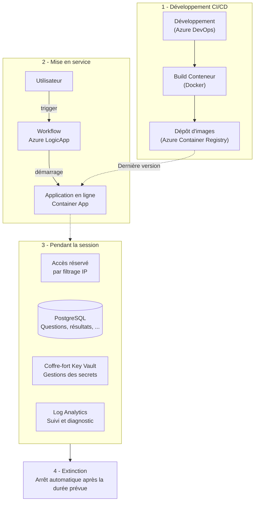

## Contexte

Cette application interne a été développée pour les besoins des **ressources humaines** : elle permet de faire passer des questionnaires techniques aux candidats lors des recrutements, QCM à réponse unique ou multiple et questions à réponse libre, sur plusieurs technologies et niveaux de difficulté, adapté au niveau choisi.

L'application couvre tout le cycle de vie de l'évaluation des candidats :

* **Correction des réponses libres** par un jury, manuellement ou assistée par **IA** ;
* **Envoi automatique du récapitulatif PDF** à la direction ;
* **Administration complète** : gestion de la banque de questions (ajout, édition, activation/désactivation, import/export CSV), historique filtrable de toutes les sessions, statistiques globales avec rapport PDF exportable pour la direction.

## Stack technique

| Composant | Technologie
|---|---|---|
| Application | Python (SQLAlchemy, Streamlit) / Azure DevOps |
| Base de données | PostgreSQL |
| Conteneurisation | Docker / Docker Compose |
| Registre d'images | Azure Container Registry |
| Hébergement | Azure Container Apps |
| Automatisation | Azure Logic Apps |
| Secrets | Azure Key Vault / Azure Identity |

## Application allumée à la demande

L'application ne sert que ponctuellement, lors des sessions de recrutement. Plutôt que de payer une infrastructure allumée en permanence, la mise en production repose sur un principe simple : **l'application est éteinte par défaut, se démarre à la demande et s'éteint toute seule**.

Concrètement, un  workflow **Logic App** joue le rôle d'automate de démarrage : déclenché par une requête HTTP qui précise une durée, il vérifie la durée demandée, refuse le démarrage si une session tourne déjà, allume la Container App, renvoie immédiatement l'URL et l'heure d'expiration à l'appelant, puis éteint l'application à l'échéance.

Côté sécurité, plusieurs choix structurants :

* **Zéro secret stocké** : l'application tire son image du registre et lit ses secrets (chaîne de connexion, clé API) via des **identités managées** et des références **Key Vault**, rien ne transite par le dépôt ni par les définitions ;
* **Accès restreint** : l'ingress public est filtré par une allowlist d'adresses IP, sans VNet ni passerelle facturée en permanence ;
* **Envoi d'emails verrouillé** : le tenant désactivant SMTP AUTH, l'envoi passe par Microsoft Graph avec une *Application Access Policy* qui restreint l'identité à une seule boîte expéditrice ;
* **Observabilité** : les journaux du conteneur sont centralisés dans Log Analytics.
* **Plafonnement** : la durée de la session est plafonnée à 24 h maximum. Un service inutilisé est préférablement arrêté pour éviter l'exposition aux attaquants.

## Intégration CI/CD

Le cycle de vie applicatif est entièrement industrialisé :

* Développement et versionnement sur **Azure DevOps** ;
* **Build et publication de l'image Docker** vers le registre, taguée par le sha du commit, ce qui garantit qu'un déploiement crée bien une nouvelle révision et permet de revenir en arrière sur n'importe quelle version ;
* **Infrastructure as Code** : les définitions de la Container App (ingress, allowlist, sondes, secrets) et du Logic App sont versionnées en JSON dans le dépôt, et déployées par des scripts idempotents. Aucune modification ne se fait depuis le portail Azure : le fichier versionné fait foi, et les permissions elles-mêmes empêchent les écarts ;

## Retour d'expérience

Ce projet illustre qu'une mise en production « sur-mesure » peut être plus pertinente qu'une architecture standard : pour une application à usage ponctuel, le duo Logic App + Container Apps offre un vrai modèle **FinOps** (aucune ressource consommée en dehors des sessions), tout en gardant un niveau de sécurité d'entreprise, identités managées, coffre-fort de secrets, filtrage réseau et traçabilité complète.
